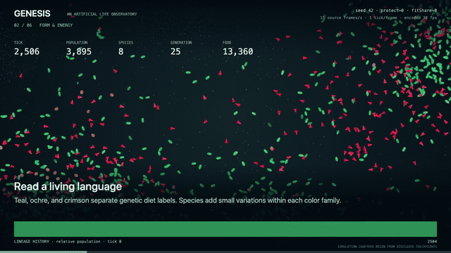

# GENESIS

I built GENESIS: **an artificial-life observatory. Observe what survives. Predict what changes.**



Neural-network organisms steer through a toroidal world, consuming resources,
reproducing, mutating, and dying. The rules are designed; the population's history
is computed. Open an evolved world, follow a lineage, then test a prediction in
Ecology Lab against a matched, untouched control.

This is a source release: clone it and run it locally. There is no hosted site.
The application has no runtime dependencies, no build step, no external fonts,
analytics, or third-party assets.

## Open it

Use **Node.js 22 or later**; the recorded Node checks used **22.11.0**.

```sh
node serve.mjs
```

Open [http://127.0.0.1:5173](http://127.0.0.1:5173). Node serves the directory on loopback only.
A modern desktop browser with WebGL2 is recommended. Canvas is available at
`?renderer=canvas`; `?scratch` starts at the beginning. A valid checkpoint loads by
default at **s42-t2400**, with its full available lineage history. Earlier and
late-world checkpoints remain selectable. Missing or corrupt checkpoints
produce a visible explanation and leave the existing world usable.

The guided observation has play/pause, previous/next and **Take control**. Drag to
pan, scroll to zoom, click an organism to inspect it, and click a lineage ribbon
to highlight its descendants. The ribbon retains the beginning and the current
endpoint through bounded, timestamped decimation; it is not a record of every birth.

**Ecology Lab:** enter a population prediction, choose a pressure and a horizon,
then lock the prediction. Two isolated worker branches restore the same exact
checkpoint. One retains its configuration; the other changes food arrival,
metabolism, or toxin energy loss. Both stop at the same requested tick. Inspect
both outcomes, return to the paused source world, or export the checkpoint,
configuration, command trace and prediction error. Cancellation is available.

The 270-second English-captioned film is not committed here (106 MB); it has not been uploaded or published
separately, and is reproducible from source with the
[reproduction instructions](docs/VIDEO.md). See also the
[generated measurement record](docs/MEASUREMENTS.md).

## Measurements from this version

<!-- GENERATED:START -->
| Checkpoint | Population | Living species | Generation |
|---|---:|---:|---:|
| s42-t1200 | 2846 | 2 | 16 |
| s42-t2400 | 3858 | 8 | 25 |
| s42-t9000 | 5587 | 42 | 49 |

Snapshot capacity: **654,432 bytes** (639.1 KiB), 13 floats per organism at configured capacities.

All measurements and configuration are in [MEASUREMENTS.md](docs/MEASUREMENTS.md).
<!-- GENERATED:END -->

The former 4.23× / 4.91× headline belongs to my own original source and
its whole-genome assay with protection enabled. It is **not a claim about this
version**. The replacement assay holds the random control genomes fixed on a
separate RNG stream and measures bodies and brains together; its changed protocol
prevents a clean old/new ratio comparison. See `evidence/whole-genome-assay.json`.
No toxin chance baseline or brain-only causal improvement is claimed.

## The observer-effect disagreement

The two reports I wrote earlier describe different experiments. The short report used an unsplit population. The longer report lowered the species threshold and measured cumulative species creation. A species label can change without changing movement, feeding or mating, because ordinary mate compatibility reads genome distance rather than the label. Fitness-sharing can feed that label difference back into reproduction.

My original-source runs reproduce that distinction. The exact **211 → 231** pair is not reproduced by the fully recorded configuration. The original source, source hashes, failing fingerprints and passing fingerprints are preserved in `evidence/`; all table values are generated from those files. I did not tune a fixture to manufacture the number I had reported earlier.

`metrics()` now reads maintained membership counts and cumulative birth/death
counters. Each Stats reader computes its own interval differences. Independent
observation schedules produce equal hashes of the recorded physical and bookkeeping state in
the tested fixtures. This is test evidence for those conditions, not a proof of
all possible executions.

## Corrections, fixes and remaining defects

The complete [archived README](docs/archive/README-before.md), annotated at the top of
that file with what in it is still wrong, is preserved verbatim except one redacted phrase
(marked `[redacted]`). Those are historical claims with historical line numbers.
[My notes from rereading the code](evidence/independent-audit.md) and
[my implementation decisions](docs/DECISIONS.md) separate source facts from what I had only
proposed in my earlier plan. This edition does not rewrite my past explanations
as if they were current personal testimony.

| Issue | Current status |
|---|---|
| Observation changes species and consumes birth/death windows | Fixed in the tested paths; repeated full-state purity tests and schedule comparisons included |
| Newborns counted twice between steps | Fixed; the pending queue is cleared after committing births |
| Re-splitting an edge duplicates innovation IDs | Fixed for new mutations; historical malformed genomes are not silently repaired |
| Save rounds weights/coordinates, loses IDs, speed, harvest, death flags and resource allocation order | Exact v4 format preserves these and CONFIG; uninterrupted/resumed continuation tests included. Legacy saves remain approximate |
| “No fitness function” | False: harvest influences crossover dominance; optional sharing also computes fitness |
| “Lifetime learning” / “XOR solved” | Unsupported: inherited networks steer; nectar and toxin are separate inputs |
| “No designed niches” | False: explicit diet, predation, metabolism and reproduction rules remain |
| Add-node is function preserving | False: an inserted tanh changes the function; deliberately retained and disclosed |
| “Zero-copy shared snapshots” | False: accepted shared reads still copy; unchanged sequences are skipped. Ownership transfer avoids a thread-to-thread payload clone, not packing or GPU upload |
| Legacy protect versus fitness sharing | Both remain available and off by default; their superiority is not established |
| Mean connections proves increasing intelligence | Unsupported. Net active-connection change is recorded and can be negative |
| Unverifiable rendering-speed claim | Recorded CPU benchmark and matched renderer samples; all three long renderer cases observed 60 FPS, but background gates failed, so a controlled speedup is not established |
| Dead localStorage helpers | Removed |

A designed artificial ecosystem, not a model of a real habitat.

Diet colors are genetic labels, not measured energy flows.

A single-seed intervention is not a general ecological law.

Replay equality is tested on the same runtime; cross-engine equality is not guaranteed.

These four sentences also appear in the application and film captions. Input events, configuration and exact checkpoint are part of a replay;
a seed alone does not specify an edited world. The transport badge reports the
active memory path, not a claim about measured GPU execution time.

## Verify and reproduce

Keep `node serve.mjs` running in another terminal for the application browser checks.
Then, from the repository root:

```sh
npm test                       # no installation step
npm run test:observer
node tools/headless.mjs 1200 42
node tools/browser-test.mjs
node tools/browser-lab-full.mjs # full 1800-tick browser food-reduction experiment
node tools/render-verify.mjs
node tools/make-checkpoints.mjs
node tools/lab-experiment.mjs
node tools/evaluate-checkpoints.mjs
node tools/build-report.mjs
```

Browser and movie tooling use an installed Chrome executable through its local
DevTools protocol. Film assembly requires FFmpeg and ffprobe. They are authoring
tools; the application itself only needs a browser and a static server.
The tools launch private Chrome profiles and close only their owned processes.
To verify an exported Lab experiment, run `node tools/replay-lab.mjs path/to/export.json`.
My [verification notes](docs/ACCEPTANCE.md) record the checks I completed and the explicit
background-load qualification on performance evidence.

Performance runs must be separate from simulation generation and video encoding:

```sh
node tools/bench.mjs
node tools/render-benchmark.mjs --focus --cpu-idle-gate --record-all --frames 3600 --warmup 180
```

The Node tool measures CPU step/pack time. The browser tool measures rendering
cadence and CPU submission time at a fixed viewport and synthetic fixture, with
baseline/current comparison. Neither substitutes for GPU timer-query measurements
or a guarantee on another device. `evidence/` contains the actual scope and load. The
recorded AC comparison observed about 60 FPS in all three primary cases, including
clade highlighting and a ribbon repainted every frame. All three failed at least
one predeclared background-idle check; their raw samples remain available, without
claiming a controlled speedup or quiet-machine acceptance. See [BENCH.md](docs/BENCH.md).

The [English announcement draft](docs/ANNOUNCEMENT.md) is a local draft, kept as a record of
what this release does and does not claim.

## What is not in this repository

- `docs/genesis-film.mp4` (270s, 106 MB) — over GitHub's 100 MB file limit; reproducible from
  source with [docs/VIDEO.md](docs/VIDEO.md).
- Rendered evidence images (screenshots, film stills) and a few large raw per-frame benchmark
  and capture JSON files. The numbers they support are generated into
  [MEASUREMENTS.md](docs/MEASUREMENTS.md), [ACCEPTANCE.md](docs/ACCEPTANCE.md) and
  [BENCH.md](docs/BENCH.md); the JSON these tables were generated from stays in the working
  copy this was cut from. Re-running the tools in **Verify and reproduce** below regenerates
  fresh copies of all of it.
- One pre-implementation, in-progress handoff note for an unfinished feature (multi-world
  migration). It described in-progress work, not this release, and is dropped rather than
  carried into a public history.

Nothing in this list changes any claim, number or table below; every generated figure in this
README and in `docs/` was produced from evidence that ships in this repository.

## Architecture

Native ES modules: `world` / `creature` / `neat` implement the simulation;
`sim.worker` owns stepping and command boundaries; compact render snapshots feed
WebGL or Canvas; `stats` stores rolling charts and decimated lineage history;
`lab` forks matched worker branches; `film` uses the same renderer with exact tick
advancement and no wall-clock simulation scheduling.

Source-available; any use beyond reading and personal evaluation needs my written permission — see [LICENSE](LICENSE). The archived snapshot in `evidence/original-source.zip` and `docs/archive/` keeps the license text it had at the time, but it is published here under the same terms as the rest of this repository.
